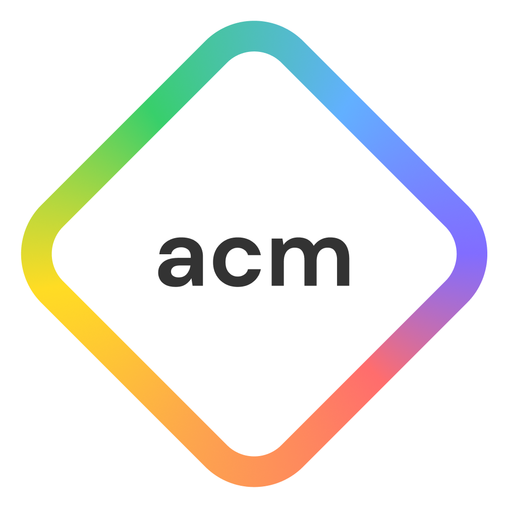

# Hi! I'm Tanner

## I am a third-year Computer Science Student at UCSD. Rockstar by night, guitarist/vocalist, and food critic. I am passionate about creating software that impacts millions of lives.

 

[Click Here](https://docs.google.com/document/d/1dsNcJVkYa7-Yk1LUpLv44uJOBUBRxxgXOl5TkW5H4qY/edit?usp=sharing) to view my resume (External Link)

### I am currently:

* Software Lead for **ACM Projects**
    * Team of six, developing a MERN stack web application, focusing on collaborative ride-sharing for cost-efficient airport transportation.
* Staff for **ACM Events**
    * Creating professional development workshops, leading leetcode sessions, and working with the events team weekly.

### I have previously:

* Interned for **Coding4Youth** and **JrCoder**
    * Led weekly classes in C++, Java, Lua, and Arduino for groups of up to 8 middle and high school students.
* Officer for **Santa Barbara City College's Computer Science Club**
    * Organized weekly events and workshops in collaboration with a team, including guest lectures, mock interviews, and competitions.

### Skills

1. C++
2. C
3. Java
4. Git/GitHub
5. Eclipse, Visual Studio Code, STM32CubeIDE

### Additional Experience in:

1. Keil uVision
2. Vim
3. GDB
4. Valgrind
5. Linux
6. Python
7. Lua
8. ARM Assembly
9. MERN Stack

Test Quote
> This is a quote

```
char[] test = "Here is a test";
```

[Click Here](#hi-im-tanner) to go back to the top

[Click Here](README.md) to go to the readme file

I love
- [x] Chinese Food
- [x] Mexican Food
- [x] Indonesian Food
- [x] Thai Food
- [x] Ethiopian Food
- [x] Indian Food
- [x] American Food
- [x] Italian Food
- [ ] Raw Tomatoes


